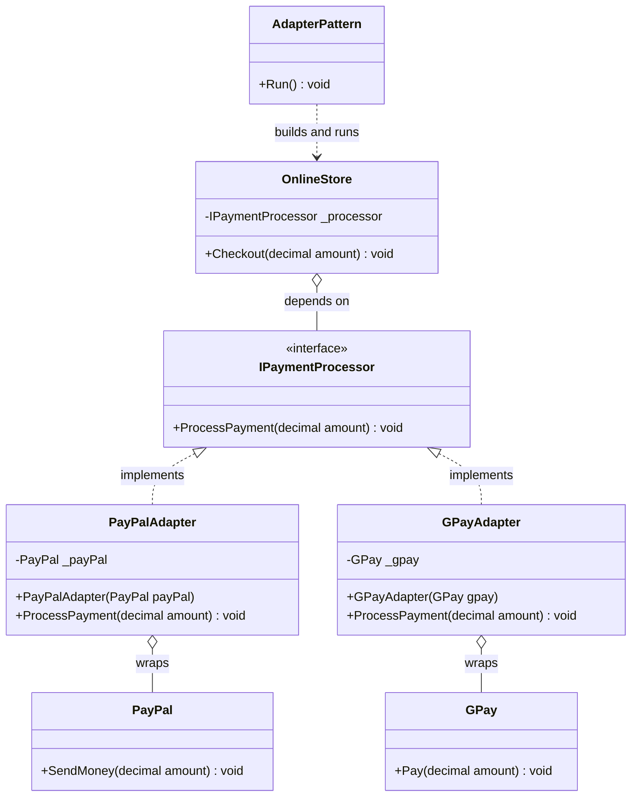
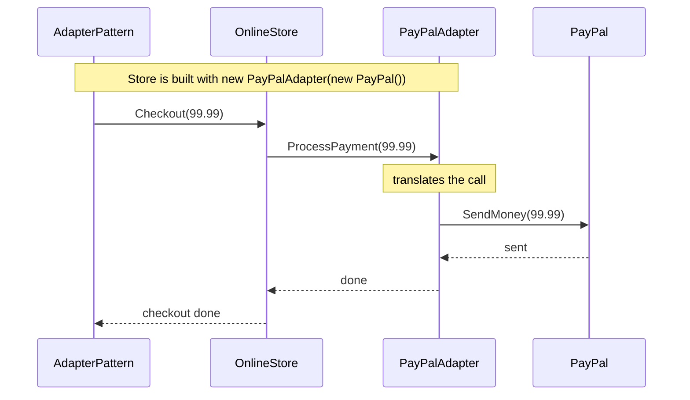
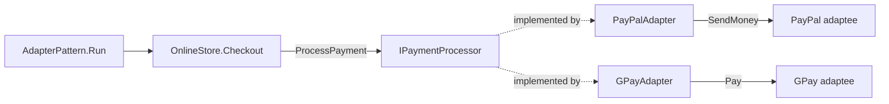

# Adapter Pattern

> **Intent:** Wrap an incompatible third-party class so it satisfies the interface your own code already expects, without changing either side.

**Category:** Structural

## Participants
- **Client** (`AdapterPattern`) — demo entry point; wires each store to an adapter and runs the checkout flow via `Run()`.
- **Target interface** (`IPaymentProcessor`) — your own contract, exposing `ProcessPayment(decimal amount)`.
- **Context / Consumer** (`OnlineStore`) — depends only on `IPaymentProcessor`; its `Checkout` calls `ProcessPayment` and never references a provider directly.
- **Adapters** (`PayPalAdapter`, `GPayAdapter`) — implement `IPaymentProcessor` and translate `ProcessPayment` into the adaptee's own method.
- **Adaptees** (`PayPal`, `GPay`) — third-party classes with mismatched method names (`PayPal.SendMoney`, `GPay.Pay`); cannot be modified.

## UML class diagram

> New to UML notation? See [UML-GUIDE](../UML-GUIDE.md).

## Sequence diagram

## Flow diagram

## How it works (in this project)
1. `AdapterPattern.Run()` builds `new OnlineStore(new PayPalAdapter(new PayPal()))` and calls `Checkout(99.99m)`.
2. `OnlineStore.Checkout` only knows `IPaymentProcessor`, so it calls `_processor.ProcessPayment(amount)`.
3. `PayPalAdapter.ProcessPayment` translates the call into `_payPal.SendMoney(amount)`.
4. The second store uses `GPayAdapter` wrapping `GPay`, so the same `ProcessPayment` call becomes `_gpay.Pay(amount)`.
5. The store code is identical for both providers — only the injected adapter changes.

## When to use
- You must integrate a third-party or legacy class whose API you cannot change.
- Existing code depends on a stable interface, but a new component exposes a different signature.
- You want to swap interchangeable providers behind one contract without touching consumers.

## Analogy
A travel power-plug adapter lets your device fit a foreign socket without rewiring either one.
