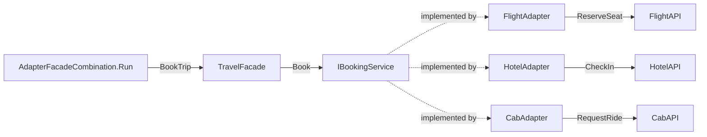

# Adapter + Facade Combination Pattern

> **Intent:** Normalize several mismatched third-party APIs behind adapters, then expose them through one facade so the client makes a single simple call.

**Category:** Structural

## Participants
- **Client** (`AdapterFacadeCombination`) — demo entry point; via `Run()` it creates a `TravelFacade` and calls `BookTrip`, unaware of adapters or APIs.
- **Facade** (`TravelFacade`) — single entry point exposing `BookTrip`; holds three `IBookingService` references and calls each one.
- **Target interface** (`IBookingService`) — common contract with `Book(string name)` that every adapter implements.
- **Adapters** (`FlightAdapter`, `HotelAdapter`, `CabAdapter`) — implement `IBookingService` and translate `Book` into the adaptee's own method.
- **Adaptees** (`FlightAPI`, `HotelAPI`, `CabAPI`) — third-party systems with mismatched methods (`ReserveSeat`, `CheckIn`, `RequestRide`); cannot be modified.

## Flow diagram

## How it works (in this project)
1. `AdapterFacadeCombination.Run()` creates one `TravelFacade` and calls `travel.BookTrip("Raj")`.
2. `TravelFacade`'s constructor wires each adapter to its API: `new FlightAdapter(new FlightAPI())`, `new HotelAdapter(new HotelAPI())`, `new CabAdapter(new CabAPI())`, storing them as `IBookingService`.
3. `BookTrip` calls `Book(name)` on the flight, hotel, and cab services in turn.
4. Each adapter translates `Book` into its adaptee's method — `ReserveSeat`, `CheckIn`, `RequestRide`.
5. The client sees one call; adapters hide the API differences and the facade hides the wiring.

## Why combine them
The **adapters** normalize each incompatible third-party API to the shared `IBookingService.Book` contract, so nothing downstream cares about `ReserveSeat` vs `CheckIn` vs `RequestRide`. The **facade** (`TravelFacade`) then layers on top to give the client one simple `BookTrip` entry point that coordinates all the normalized services. Adapters solve *incompatibility*; the facade solves *complexity* — together the client stays fully decoupled from the third parties.

## When to use
- You depend on multiple external systems with differing APIs and want one clean entry point.
- You want to add or replace a provider without touching client or facade logic beyond wiring.
- You want incompatibility (adapters) and orchestration (facade) handled in separate, focused layers.

## Analogy
A travel agent (facade) books your whole trip through one request, while behind the scenes universal booking forms (adapters) let each airline, hotel, and cab firm be dealt with the same way.
