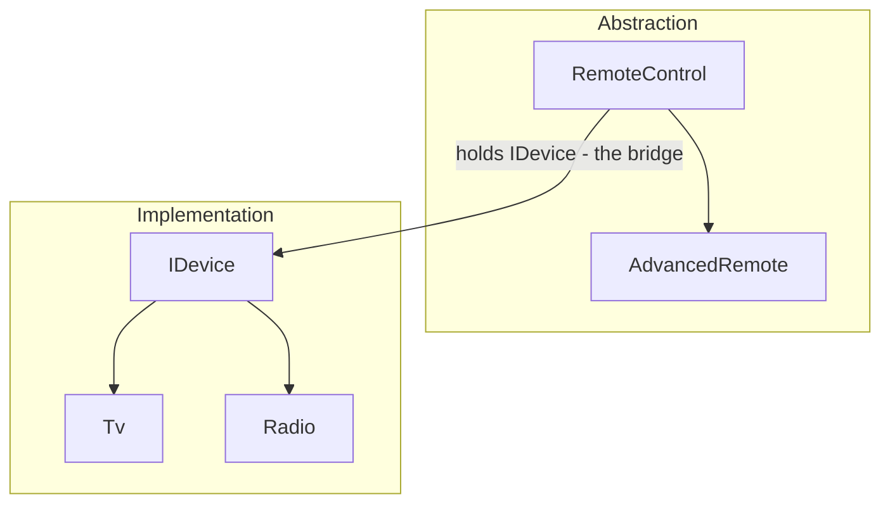

# Bridge Pattern

> **Intent:** Split something that varies in **two independent ways** into two hierarchies — an *abstraction* and an *implementation* — joined by a reference, so each can change without touching the other.

**Category:** Structural

## The problem it avoids
Modelling two dimensions with inheritance alone explodes into a subclass per combination
(`BasicTvRemote`, `AdvancedTvRemote`, `BasicRadioRemote`, …) — **n × m** classes. Bridge separates the
dimensions so growth is **n + m**: add a device and every remote controls it; add a remote and it
drives every device.

## Participants
- **Abstraction** (`RemoteControl`) — high-level control; holds a reference to an `IDevice` (**the bridge**) and delegates to it.
- **Refined Abstraction** (`AdvancedRemote`) — adds features (e.g. `Mute()`); works with *any* device.
- **Implementor** (`IDevice`) — interface of low-level operations (`SetPower`, `SetVolume`).
- **Concrete Implementors** (`Tv`, `Radio`) — the real devices, unaware of which remote drives them.
- **Client** (`BridgePattern`) — `Run()` pairs any remote with any device.

## Flow diagram

## How it works (in this project)
1. `BridgePattern.Run()` creates `new RemoteControl(new Tv())` — a remote bridged to a device.
2. `TogglePower()` / `SetVolume(30)` on the remote **delegate** to the injected `IDevice` (`Tv`).
3. `new AdvancedRemote(new Radio())` reuses the same bridge; `Mute()` calls `Device.SetVolume(0)`.
4. Because the remote only holds an `IDevice`, **any** remote works with **any** device — no combinatorial subclasses.

## Bridge is composition, not inheritance
`RemoteControl` **has-a** `IDevice` (a field), it is **not** a `Tv`. That single reference is the
"bridge" that lets the two towers slide independently.

## When to use
- Two (or more) **independent dimensions** both vary (control × device, shape × renderer, report × export-format).
- You see a **subclass explosion** of combined names.
- You want to pick or switch the implementation **at runtime**.

## When not to
- Only one dimension varies → use **Strategy** (or plain inheritance).
- The implementation will never grow → the extra indirection isn't worth it.

## Bridge vs Adapter vs Strategy
| Pattern | Intent |
|---|---|
| **Bridge** | Designed **up front** so an abstraction hierarchy and an implementation hierarchy vary **independently** (two dimensions). |
| **Adapter** | **After the fact** — make an existing, incompatible interface fit a client (glue). |
| **Strategy** | Swap a single **behaviour/algorithm** at runtime (one dimension). |

> Bridge and Strategy look identical in code; the difference is scale — Bridge expects **both** sides to be full, growing hierarchies.

## Analogy
A **TV remote**: the remote (abstraction) and the appliance (implementation) are made by different
companies and evolve separately — any universal remote can drive any TV because they meet at a
standard interface.
