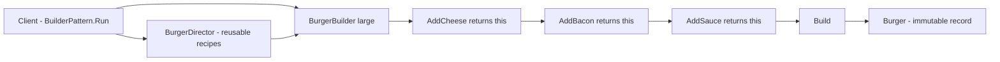

# Builder Pattern

> **Intent:** Construct a complex object step by step, letting the same construction process produce different results.

**In plain words:** Instead of one giant constructor with lots of arguments, you add the parts you want one at a time and then ask for the finished object. Think of ordering a burger: you tell the cook "add cheese, add bacon, add sauce", and only at the end do you get the assembled burger.

**Category:** Creational

## Participants
- **Product** (`Burger`) — the finished, immutable object. A `record` holding `Size`, `Cheese`, `Bacon`, `Lettuce`, `Sauce`.
- **Builder** (`BurgerBuilder`) — collects choices one step at a time. Each `Add...()` method flips a field and returns `this`, so calls can be chained. `Build()` produces the `Burger`.
- **Director** (`BurgerDirector`) — stores reusable recipes (fixed step sequences) like `CheeseBurger()` and `BaconDeluxe()`, so clients don't repeat common combinations.
- **Client** (`BuilderPattern`) — the demo entry point `BuilderPattern.Run()`; builds a custom burger with the fluent builder and also asks the director for a ready-made recipe.

## Flow diagram

## How it works (in this project)
1. `BuilderPattern.Run()` creates `new BurgerBuilder("large")` — `size` is required, so it goes through the constructor.
2. It chains `.AddCheese().AddBacon().AddSauce()`. Each method sets one optional field and `return this`, which is what makes the chaining work.
3. `.Build()` calls `new Burger(...)` with the collected fields, producing the immutable `Burger` record.
4. For a common combination, `Run()` instead calls `new BurgerDirector().BaconDeluxe()`, which runs a fixed builder sequence internally so the client doesn't have to.

## When to use
- An object has many optional parts and you want to avoid a telescoping constructor (lots of parameters, many overloads).
- You want a readable, fluent way to configure an object step by step.
- The same building steps should be able to produce different variations of the product.

## When NOT to
- The object is simple with only a couple of fields — a plain constructor or object initializer is clearer.
- All fields are required anyway; the builder adds ceremony without benefit.

## Gotchas
- Forgetting to `return this` from a step breaks the chain — every `Add...()` must return the builder.
- The builder is mutable while collecting choices; the `Burger` product is immutable. Don't confuse the two — reusing one builder instance after `Build()` keeps the old choices.
- The director is optional. It only helps when the same step sequences repeat; skip it for one-off custom builds.
