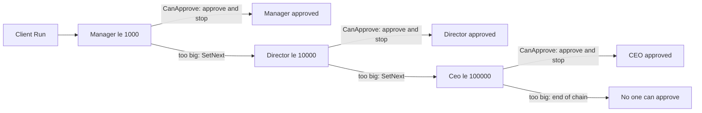

# ChainOfResponsibility Pattern

> **Intent:** Pass a request along a chain of handlers so each one either handles it or forwards it to the next.

**In plain words:** Like an expense claim that moves up the org chart — your manager approves small amounts, bigger ones go to the director, then the CEO — each person handles it if they can, otherwise passes it up.

**Category:** Behavioral

## Participants
- **Handler** (`Approver`) — abstract base holding the `_next` link; its `Handle` either approves via `Approve` (when `CanApprove` is true) or forwards to `_next`.
- **Concrete Handler** (`Manager`) — approves amounts le 1000.
- **Concrete Handler** (`Director`) — approves amounts le 10000.
- **Concrete Handler** (`Ceo`) — approves amounts le 100000.
- **Client** (`ChainOfResponsibilityPattern`) — builds the chain with `SetNext` and fires requests through `Handle`.

## Flow diagram

## How it works (in this project)
1. `ChainOfResponsibilityPattern.Run()` creates a `Manager`, then wires the chain: `manager.SetNext(new Director()).SetNext(new Ceo())`. `SetNext` returns the link just added, so the calls read left to right as Manager -> Director -> CEO.
2. `manager.Handle(500)` — `Manager.CanApprove(500)` is true (le 1000), so it approves and stops.
3. `manager.Handle(5_000)` — Manager can't (gt 1000), forwards to `Director`, who approves (le 10000).
4. `manager.Handle(50_000)` — Manager and Director both pass; `Ceo` approves (le 100000).
5. `manager.Handle(500_000)` — nobody qualifies; `Ceo._next` is null, so the base `Handle` prints "No one can approve".

## When to use
- Multiple handlers could process a request and you want to decouple sender from receiver.
- The set or order of handlers should be configurable at runtime.
- Requests escalate through tiers (approval limits, log levels, event filters).

## When NOT to
- Exactly one handler always deals with the request — a direct call or dictionary lookup is simpler.
- Every request must be guaranteed handled and silent fall-through would be a bug.

## Gotchas
- If no handler qualifies, the request falls off the end of the chain — here it just prints a message rather than throwing, so unhandled requests can pass silently.
- Order matters: since each handler stops as soon as `CanApprove` is true, put the most specific/lowest-limit handler first.
