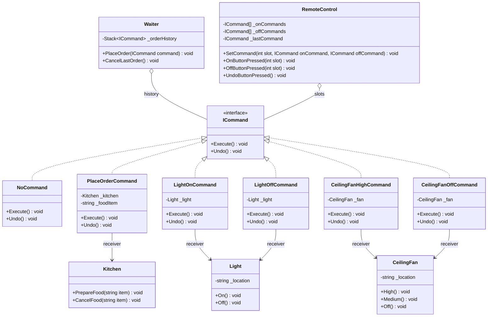
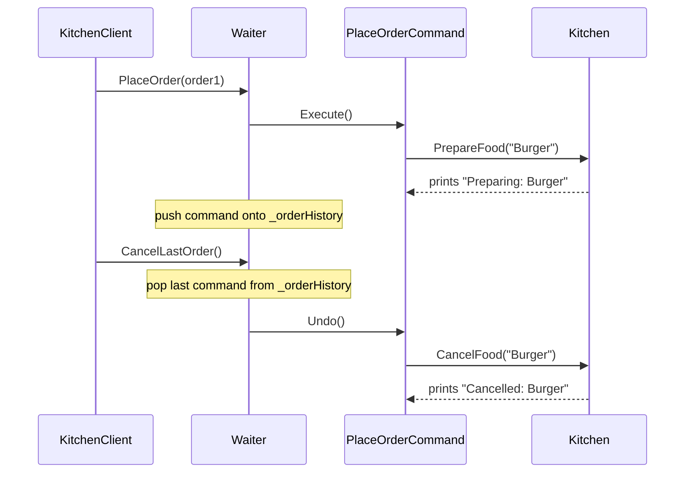
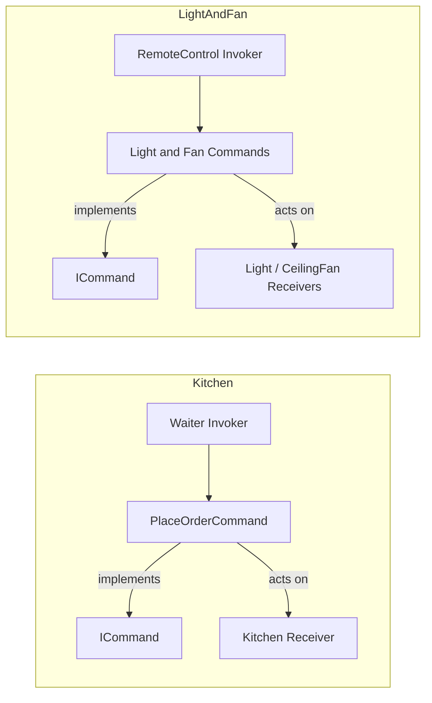

# Command Pattern

> **Intent:** Encapsulate a request as an object so it can be parameterised, queued, logged, and undone — decoupling the invoker from the receiver that does the work.

**Category:** Behavioral

## Participants
- **Command** (`ICommand`) — interface with `Execute()` and `Undo()`.
- **Null Object** (`NoCommand`) — safe default `ICommand` so empty slots need no null checks.
- **Client** (`CommandPattern`) — entry point; `Run()` runs both example clients.

### Kitchen example (`DesignPatterns.Command.KitchenExample`)
- **Invoker** (`Waiter`) — executes commands and keeps a `Stack<ICommand>` history to undo the last order.
- **Concrete Command** (`PlaceOrderCommand`) — wraps a food item; `Execute()` prepares, `Undo()` cancels.
- **Receiver** (`Kitchen`) — actually prepares/cancels food.
- **Client** (`KitchenClient`).

### Light & Fan example (`DesignPatterns.Command.LightAndFanExample`)
- **Invoker** (`RemoteControl`) — 7 on/off slots plus a `_lastCommand` for undo.
- **Concrete Commands** (`LightOnCommand`, `LightOffCommand`, `CeilingFanHighCommand`, `CeilingFanOffCommand`).
- **Receivers** (`Light`, `CeilingFan`).
- **Client** (`LightAndFanClient`).

## UML class diagram

> New to UML notation? See [UML-GUIDE](../UML-GUIDE.md).

Both examples share one `ICommand` contract. Invokers hold `ICommand`s (never the receiver); each concrete command references the receiver that does the real work.

## Sequence diagram

Kitchen example — placing an order runs the command, undoing pops history and reverses it.

## Flow diagram

- **Kitchen:** `Waiter` -> `PlaceOrderCommand` -> `Kitchen`.
- **LightAndFan:** `RemoteControl` -> `Light`/`CeilingFan` commands -> `Light`/`CeilingFan`.

## How it works (in this project)
1. `CommandPattern.Run()` calls `LightAndFanClient.Run()` then `KitchenClient.Run()`.
2. **Kitchen:** `KitchenClient` builds a `Kitchen` (receiver) and `Waiter` (invoker), wraps orders as `PlaceOrderCommand`s, and calls `waiter.PlaceOrder(...)` which executes and pushes to history; `waiter.CancelLastOrder()` pops and calls `Undo()`.
3. **Light & Fan:** `LightAndFanClient` creates `Light`/`CeilingFan` receivers, wraps them in commands, loads them into `RemoteControl` slots via `SetCommand()`, then `OnButtonPressed`/`OffButtonPressed` execute and record `_lastCommand`, while `UndoButtonPressed()` reverses it.

## When to use
- You need to parameterise, queue, log, or schedule requests as first-class objects.
- You want undo/redo (cancel) support.
- You want to decouple the object that triggers an operation from the one that performs it (food ordering, banking transactions, e-commerce carts, text editors).

## Analogy
A remote-control button (or a waiter's order slip) is a stored request you can press, replay, or undo without knowing how the device (or kitchen) fulfils it.
