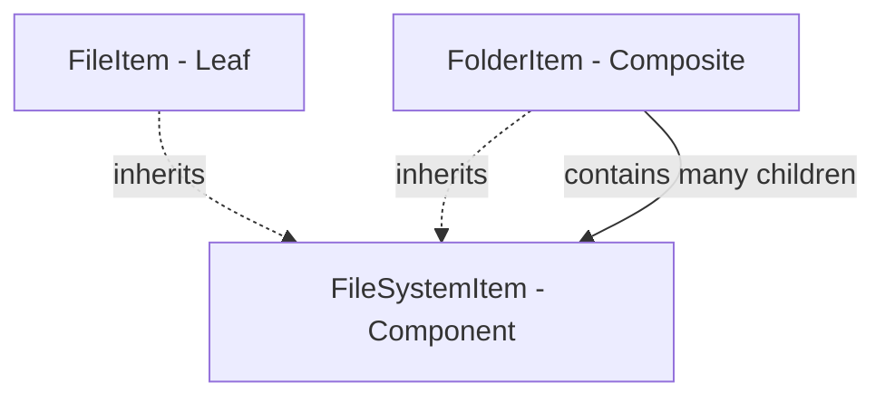

# Composite Pattern

> **Intent:** Compose objects into tree structures so that clients treat individual objects and compositions of objects uniformly.

**Category:** Structural

## Participants
- **Component** (`FileSystemItem`) — abstract base declaring the shared operations (`GetSize()`, `Print()`) that both leaves and composites answer; carries `Name`.
- **Leaf** (`FileItem`) — a single file with no children; does the real work by returning its own byte size.
- **Composite** (`FolderItem`) — a folder that holds a `List<FileSystemItem>` of children, exposes `Add`/`Remove`, and delegates operations to its children (summing sizes, recursing on print).

## Flow diagram

## How it works (in this project)
1. `CompositePattern.Run()` builds a `root` `FolderItem("project")` and adds a `FileItem("README.md", 2000)`.
2. It creates a nested `src` `FolderItem`, adds two `FileItem`s, then `root.Add(src)` — a folder inside a folder, to any depth.
3. `root.Print()` prints the folder then recurses into each child; `FileItem.Print` and `FolderItem.Print` share the same signature so the caller never checks the type.
4. `root.GetSize()` returns `_children.Sum(c => c.GetSize())`, recursing the whole tree to 10,000 bytes.

## When to use
- You want to represent part-whole hierarchies (files/folders, UI widgets, org charts).
- Clients should treat single objects and groups of objects the same way.
- Operations should recurse naturally through the tree without type checks.

## Analogy
A file system: a folder can hold files or other folders, yet asking any of them "how big are you?" works the same way.
