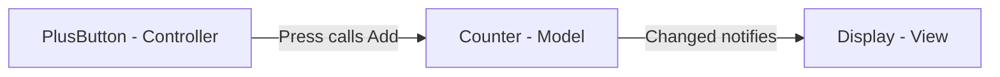

# Compound Pattern

> **Intent:** Combine two or more patterns into one reusable solution where they **cooperate as a unit** — here **Observer + Strategy**, wired as a mini-MVC (Model / View / Controller).

**Category:** Compound (Observer + Strategy)

> A compound pattern is **not** just "using several patterns in one app" — it's a *specific arrangement* of patterns pulling toward one design. This example is MVC in miniature.

## Participants
- **Model** (`Counter`) — holds state (`Count`) and **notifies** on every change via the `Changed` event. *(Observer subject.)*
- **View** (`Display`) — subscribes to `Counter.Changed` and renders `Count = n`. *(Observer subscriber.)*
- **Controller** (`PlusButton`) — turns a `Press()` into `Counter.Add(1)`; swap it for different behaviour. *(Strategy.)*
- **Client** (`CompoundPattern`) — `Run()` wires the three together.

## Flow diagram

## How it works (in this project)
1. `CompoundPattern.Run()` creates a `Counter` (model), a `Display` (view) that subscribes to `model.Changed`, and a `PlusButton` (controller) holding the model.
2. `button.Press()` calls `model.Add(1)` — the controller only touches the **model**, never the view.
3. `Counter.Add` updates `Count` and fires `Changed?.Invoke(Count)`.
4. `Display`'s handler runs and prints `Count = n`. Pressing twice prints `Count = 1` then `Count = 2`.
5. The model never references the view — they stay decoupled through the event.

## Why it's a compound (which patterns cooperate)
- **Observer** — `Counter` (subject) notifies `Display` (subscriber) through `Changed`. Add another view (a logger, a graph) and it just subscribes; nothing else changes.
- **Strategy** — `PlusButton` is the swappable behaviour behind an action. Replace it with a `MinusButton` (`Add(-1)`) or a doubling button → different behaviour, **model and view untouched**.

> Observer answers *"when?"* · Strategy answers *"do what?"*

## When to use
- You have **state + presentation + input** and want them independently swappable and testable.
- You want **many views** reacting to **one model** without the model knowing about them.
- You want to change *what an action does* without touching *what's displayed*.

## When not to
- Tiny scripts with one view and no real interaction — the event + separate controller is overhead.
- Don't just pile on patterns; combine them only when it genuinely reduces coupling.

## Analogy
A **YouTube channel**: you *subscribe* and it *notifies* you on upload (Observer); what you then *do* — watch, download, ignore — is your swappable choice (Strategy).
