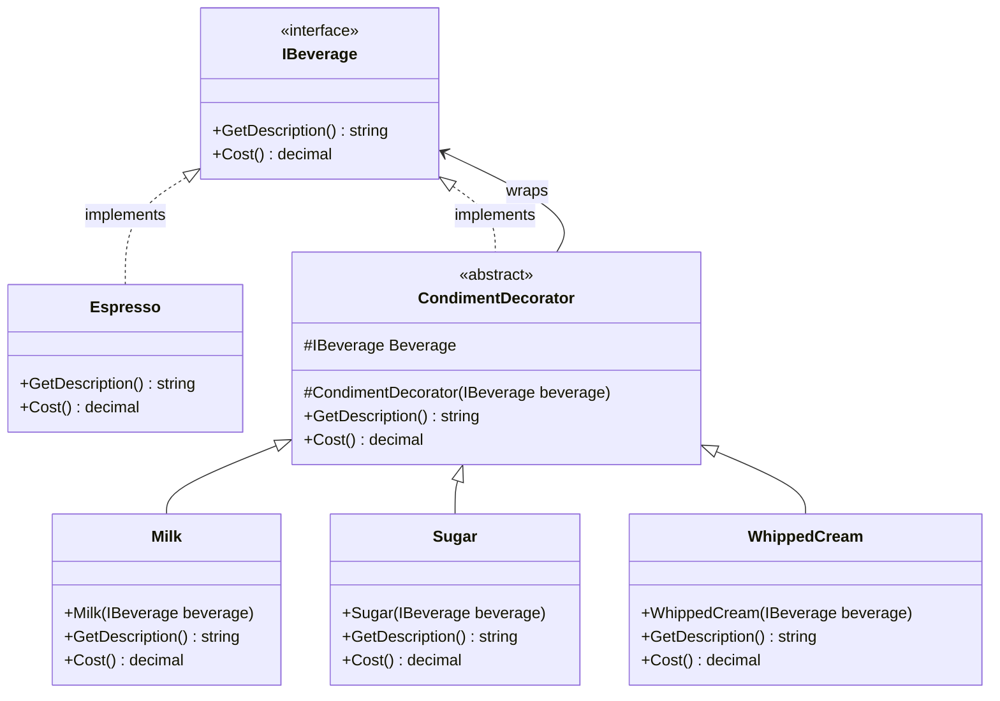
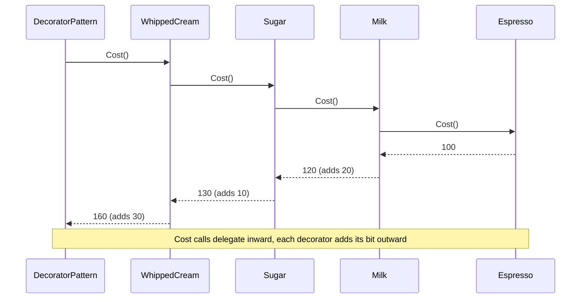
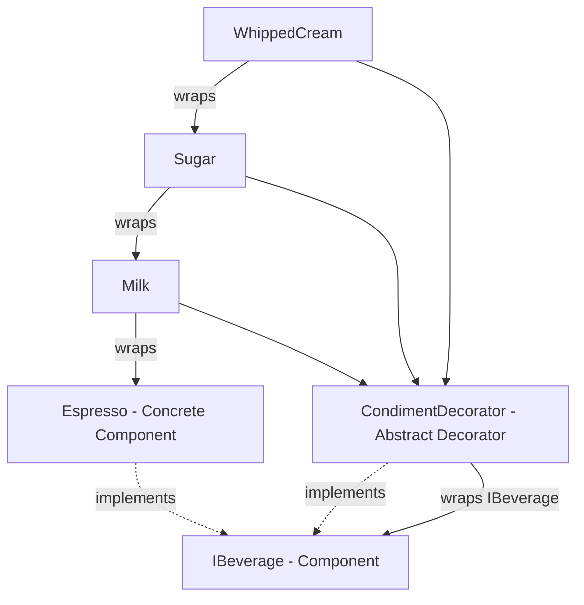

# Decorator Pattern

> **Intent:** Attach extra responsibilities to an object dynamically by wrapping it in another object that shares the same interface.

**Category:** Structural

## Participants
- **Component** (`IBeverage`) — the shared interface (`GetDescription()`, `Cost()`) that both the base object and every wrapper implement.
- **Concrete Component** (`Espresso`) — the base object being decorated; returns its own description and cost.
- **Decorator** (`CondimentDecorator`) — abstract wrapper that holds an `IBeverage` reference and also implements `IBeverage`, so wrappers can nest.
- **Concrete Decorators** (`Milk`, `Sugar`, `WhippedCream`) — each delegates to the wrapped beverage and adds its own text and cost on top.

## UML class diagram

> New to UML notation? See [UML-GUIDE](../UML-GUIDE.md).

## Sequence diagram

## Flow diagram

## How it works (in this project)
1. `DecoratorPattern.Run()` creates the base object: `IBeverage coffee = new Espresso();`.
2. It wraps it in layers: `coffee = new Milk(coffee)`, then `new Sugar(coffee)`, then `new WhippedCream(coffee)` — each wrapper stores the previous `IBeverage`.
3. Calling `coffee.GetDescription()` walks the chain: `WhippedCream` asks `Sugar`, which asks `Milk`, which asks `Espresso`, and each appends its own text on the way back.
4. `coffee.Cost()` sums the same way: `Espresso` 100 + `Milk` 20 + `Sugar` 10 + `WhippedCream` 30 = 160.

## When to use
- You need to add responsibilities to individual objects at runtime, not to a whole class.
- Subclassing would explode into every combination (MilkSugarCoffee, MilkWhippedCoffee, ...).
- The added behaviour should stack in any order and be removable.

## Analogy
Dressing a coffee: start with espresso, then add milk, sugar, and whipped cream — each topping wraps the last and adds to the description and price.
