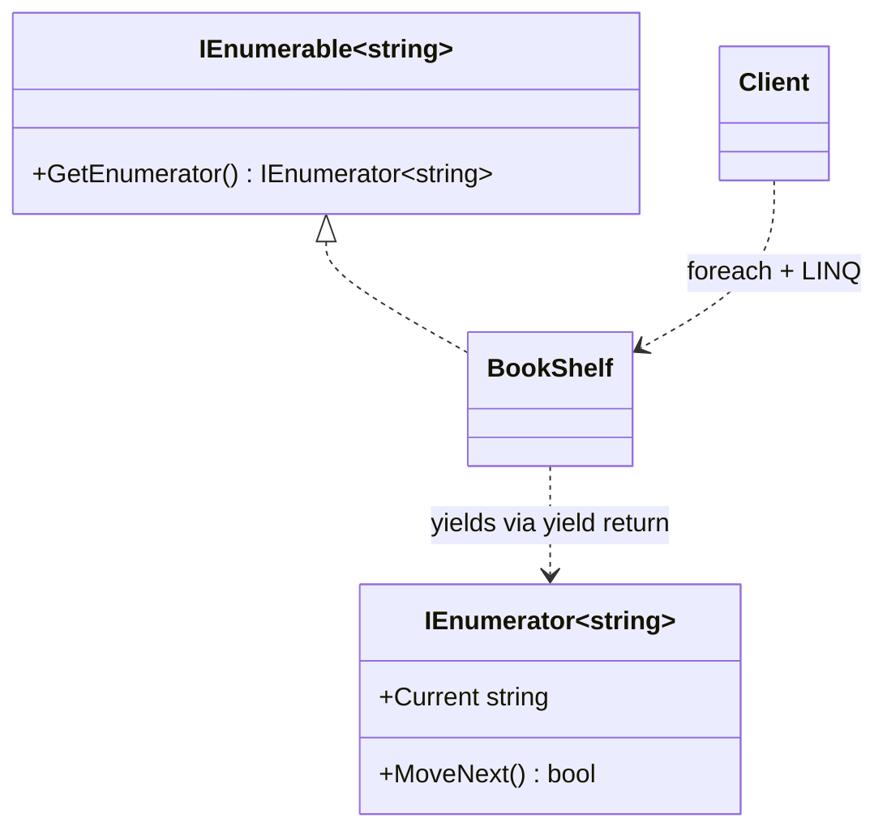

# Enumerator Pattern

> **Intent:** Provide sequential access to a collection's elements — the same goal as the Iterator pattern, but implemented with .NET's built-in `IEnumerable`/`IEnumerator` and `yield return`, so `foreach` and LINQ work for free instead of a hand-rolled custom iterator.

**Category:** Behavioral

## Participants
- **Enumerable** (`BookShelf`) — implements `IEnumerable<string>`; stores books in an array and yields them from `GetEnumerator()`.
- **Enumerator** (`IEnumerator<string>`) — the cursor with `MoveNext`/`Current`, generated automatically by the compiler from the `yield return` loop.
- **Non-generic bridge** (`IEnumerable.GetEnumerator`) — legacy interface method that delegates to the generic version.
- **Client** (`EnumeratorPattern`) — iterates with `foreach` and calls LINQ operators via `Run()`.

## Flow diagram

## How it works (in this project)
1. `EnumeratorPattern.Run()` creates a `BookShelf(3)` and adds three titles.
2. `foreach (var book in shelf)` implicitly calls `GetEnumerator()`.
3. The `yield return _books[i]` loop lets the compiler generate the cursor plus `MoveNext`/`Current` — one method replaces the entire `BookShelfIterator` class from the hand-rolled version.
4. Because `BookShelf` is `IEnumerable<string>`, LINQ works for free: `First()`, `Count()`, and `Any(b => b.Contains("GoF"))`.

## When to use
- You are on .NET and want idiomatic iteration — prefer this over the hand-rolled Iterator pattern.
- You want `foreach` and the full LINQ surface without writing cursor bookkeeping.
- Iterator state is complex and `yield return` can express it more simply than a manual class.

## Analogy
A music playlist you just press "next" on — the player tracks the position for you, and you get shuffle and search built in.
