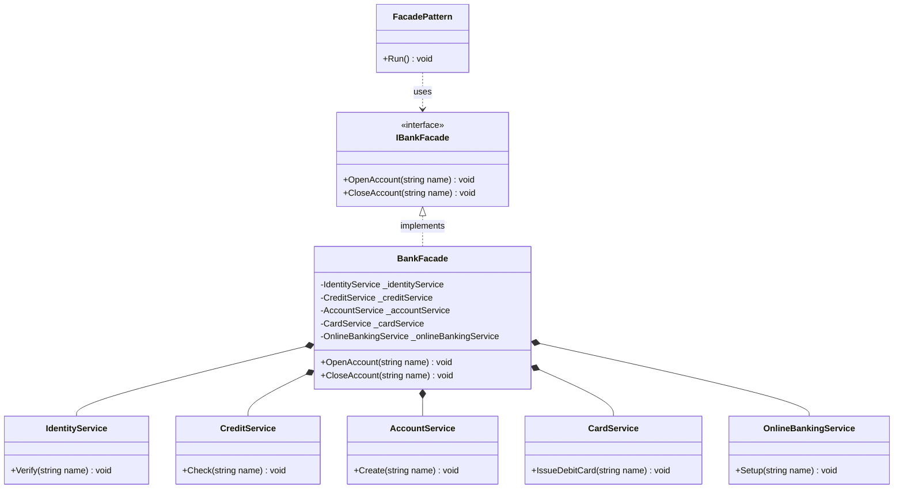
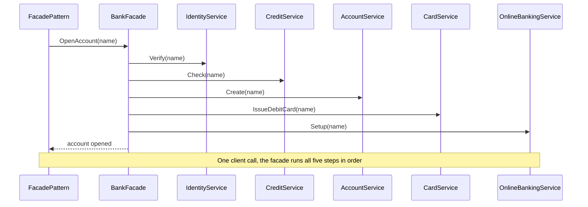
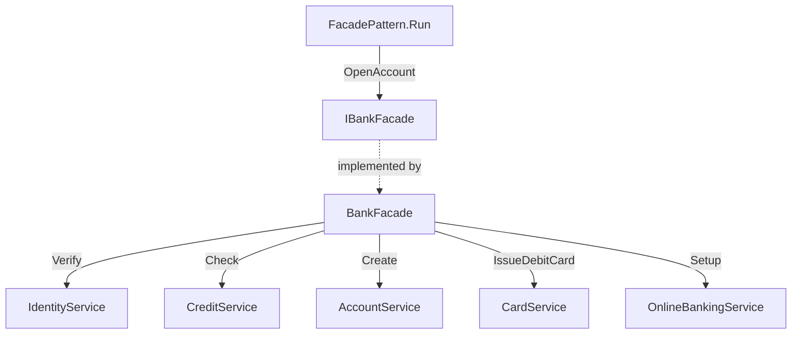

# Facade Pattern

> **Intent:** Provide one simple entry point that hides a complex subsystem and coordinates its parts in the right order.

**Category:** Structural

## Participants
- **Client** (`FacadePattern`) — demo entry point; via `Run()` it holds an `IBankFacade` (backed by a `BankFacade`) and calls `OpenAccount`, knowing nothing about the subsystem.
- **Facade contract** (`IBankFacade`) — interface declaring `OpenAccount`/`CloseAccount`; the client depends on this abstraction so the concrete facade can be mocked or swapped.
- **Facade** (`BankFacade : IBankFacade`) — single entry point implementing the contract; owns and orchestrates every subsystem service.
- **Subsystem services** (`IdentityService`, `CreditService`, `AccountService`, `CardService`, `OnlineBankingService`) — each does one job (`Verify`, `Check`, `Create`, `IssueDebitCard`, `Setup`) and is unaware of the facade.

## UML class diagram

> New to UML notation? See [UML-GUIDE](../UML-GUIDE.md).

## Sequence diagram

## Flow diagram

## How it works (in this project)
1. `FacadePattern.Run()` holds an `IBankFacade bank = new BankFacade()` and calls `bank.OpenAccount("Raj")`.
2. `BankFacade` instantiates all five services as private fields, so the client never sees them.
3. `OpenAccount` runs the subsystems in sequence: `Verify` → `Check` → `Create` → `IssueDebitCard` → `Setup`.
4. `CloseAccount` reuses the same services in a different order to tear an account down.
5. The client makes one call; all ordering and coordination stay inside the facade.

## When to use
- You want a simple, high-level entry point to a complex subsystem.
- You want to decouple clients from the many classes that do the real work.
- You want a stable API in front of parts that may change or be reordered later.

## Analogy
Calling a bank's customer-care agent to "open an account" — one request, and the agent runs every step behind the scenes.
