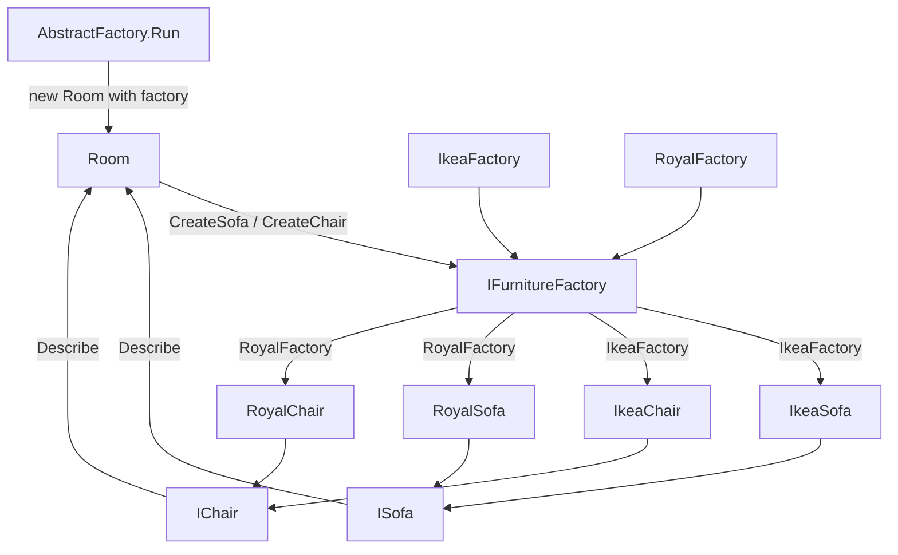

# Abstract Factory Pattern

> **Intent:** Create whole families of related objects through one factory interface, so the client gets a matching set without naming the concrete classes.

**Category:** Creational

## Participants
- **Abstract Factory** (`IFurnitureFactory`) — contract with `CreateSofa()` and `CreateChair()`.
- **Concrete Factories** (`IkeaFactory`, `RoyalFactory`) — each produces one consistent family of products.
- **Abstract Products** (`ISofa`, `IChair`) — abstractions with `Describe()`; the client only sees these.
- **Concrete Products** (`IkeaSofa`, `IkeaChair`, `RoyalSofa`, `RoyalChair`) — implementations grouped by brand.
- **Client** (`Room`) — takes an `IFurnitureFactory` in its constructor, builds a sofa and chair, and `Describe()`s them.
- **Demo** (`AbstractFactory`) — `Run()` builds a `Room` per factory to show family switching.

## Flow diagram

## How it works (in this project)
1. `AbstractFactory.Run()` creates `var room1 = new Room(new IkeaFactory())`.
2. `Room`'s constructor calls `factory.CreateSofa()` and `factory.CreateChair()`, getting an `IkeaSofa` and `IkeaChair` (stored only as `ISofa` / `IChair`).
3. `room1.Describe()` prints `IKEA Modern Sofa` then `IKEA Modern Chair`.
4. `Run()` then builds `room2 = new Room(new RoyalFactory())`; the same `Room` code now yields a matched `Royal` family — no changes to `Room`.

## When to use
- You need families of related objects that must be used together.
- You want to switch the entire family at once (theme, brand, provider).
- You want client code independent of concrete product classes.

## Analogy
Picking a furniture brand: choose IKEA or Royal and every piece you receive matches — you never end up with an IKEA sofa beside a Royal chair.
