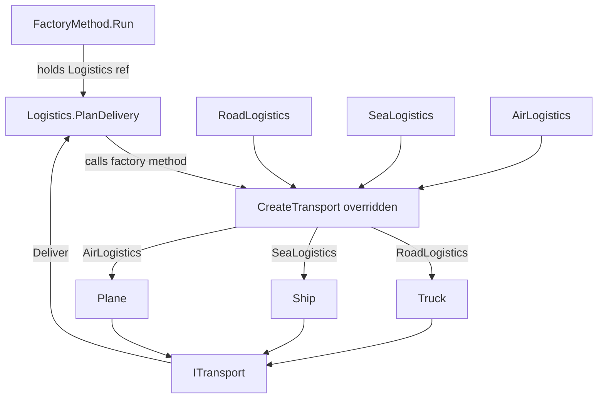

# Factory Method Pattern

> **Intent:** Define a creation method in a base class but let each subclass decide which concrete product to instantiate.

**Category:** Creational

## Participants
- **Creator** (`Logistics`) — abstract base declaring the factory method `CreateTransport()` and the business logic `PlanDelivery()` that uses it.
- **Concrete Creators** (`RoadLogistics`, `SeaLogistics`, `AirLogistics`) — override `CreateTransport()` to return a specific transport.
- **Product** (`ITransport`) — abstraction with `Deliver()`; the base class only ever touches this type.
- **Concrete Products** (`Truck`, `Ship`, `Plane`) — implementations of `ITransport`.
- **Client / Demo** (`FactoryMethod`) — `Run()` holds a `Logistics` reference, swaps concrete creators, and calls `PlanDelivery()`.

## Flow diagram

## How it works (in this project)
1. `FactoryMethod.Run()` assigns `Logistics logistics = new RoadLogistics()` and calls `logistics.PlanDelivery()`.
2. `PlanDelivery()` (defined once in `Logistics`) calls the overridden `CreateTransport()`, which returns a `Truck`, then invokes `Deliver()` → `Delivering by road in a Truck.`
3. The demo reassigns `logistics` to `SeaLogistics` then `AirLogistics`; the same `PlanDelivery()` now produces a `Ship`, then a `Plane`.
4. Adding a new transport means adding a `Concrete Product` plus a `Concrete Creator` — `Logistics` never changes.

## When to use
- You do not know ahead of time which concrete product is needed.
- You want subclasses to decide what gets created while sharing common workflow.
- You want to add new product types without touching existing code.

## Analogy
A logistics firm: the delivery process is fixed, but the road, sea, and air branches each provide their own vehicle.
