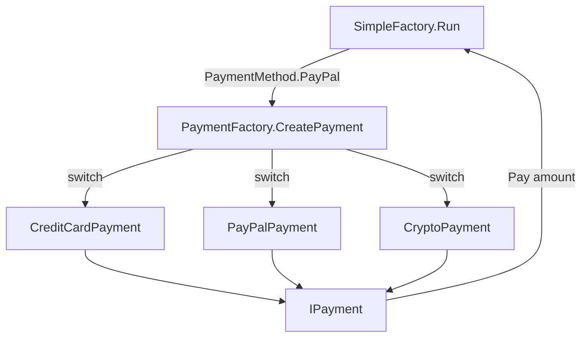

# Simple Factory Pattern

> **Intent:** Move object creation behind a single method so the client asks the factory for a product by choice instead of using `new` on concrete classes.

**Category:** Creational

## Participants
- **Factory** (`PaymentFactory`) — static class with `CreatePayment(PaymentMethod)` that switches on the enum and returns the matching `IPayment`.
- **Selector** (`PaymentMethod`) — enum (`CreditCard`, `PayPal`, `Crypto`) the client passes to say which product it wants.
- **Product** (`IPayment`) — the abstraction the client codes against; exposes `Pay(decimal)`.
- **Concrete Products** (`CreditCardPayment`, `PayPalPayment`, `CryptoPayment`) — implementations of `IPayment`.
- **Client / Demo** (`SimpleFactory`) — `Run()` picks a `PaymentMethod`, asks the factory for an `IPayment`, and calls `Pay`.

## Flow diagram

## How it works (in this project)
1. `SimpleFactory.Run()` sets `PaymentMethod userSelection = PaymentMethod.PayPal`.
2. It calls `PaymentFactory.CreatePayment(userSelection)`, which `switch`es on the enum and returns `new PayPalPayment()` typed as `IPayment`.
3. The client calls `paymentProcessor.Pay(150.00m)`, printing `Processing PayPal payment of $150`.
4. An unknown enum value makes the factory throw `ArgumentException`.

## When to use
- Creation logic is a simple choice over a small, known set of types.
- You want one place to change how products are built, keeping `new` out of client code.
- You do not yet need per-family creators or subclass-driven creation.

## Analogy
A vending machine: you press a button (enum) and it hands you the right item — you never assemble it yourself.
