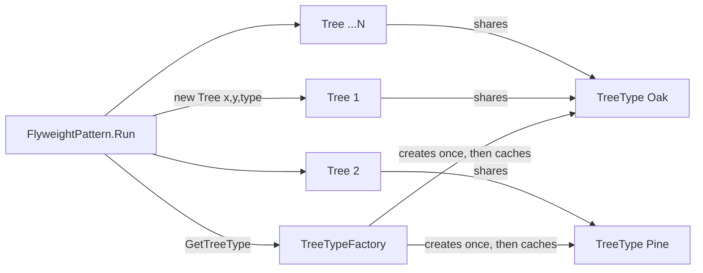

# Flyweight Pattern

> **Intent:** Share one immutable "heavy" object across many similar objects so you store the common state once instead of duplicating it everywhere.

**In plain words:** Instead of giving every tree its own copy of "I'm a green oak with this texture", all oaks point at a single shared oak description and only remember their own position. Like a stamp: one inked stamp prints thousands of identical marks; you just move it to a new spot each time.

**Category:** Structural

## Participants
- **Flyweight** (`TreeType`) — the shared, immutable *intrinsic* state: `Name`, `Color`, `Texture`. Reused by many trees. Its `Draw(x, y)` takes position as a parameter rather than storing it.
- **Context** (`Tree`) — one lightweight object per tree. Holds the *extrinsic* state (`x`, `y`) plus a pointer to a shared `TreeType`.
- **Flyweight Factory** (`TreeTypeFactory`) — creates each `TreeType` once, caches it in a dictionary, and hands back the same instance for repeat requests.
- **Client** (`FlyweightPattern`) — plants the forest, always getting flyweights through the factory.

## Flow diagram

## How it works (in this project)
1. `FlyweightPattern.Run()` is the demo entry point. It loops one million times, alternating between "Oak" and "Pine".
2. For each tree it calls `TreeTypeFactory.GetTreeType(...)`. The factory builds a cache key from `name|color|texture` and, on the first request for that key, constructs a new `TreeType` and stores it; every later request returns the *same* instance.
3. Each `new Tree(i, i * 2, type)` stores only its position and a reference to the shared `TreeType` — the extrinsic state.
4. `tree.Draw()` forwards to `type.Draw(x, y)`, passing the position into the shared flyweight.
5. The final line prints that 1,000,000 trees share only `TreeTypeFactory.DistinctTypes` (2) `TreeType` objects in memory.

## When to use
- You need a very large number of similar objects and memory is a concern.
- Most of each object's state can be split into shared (intrinsic) data and per-instance (extrinsic) data.
- The shared state is immutable and safe to reuse.

## When NOT to
- You only have a handful of objects — the extra factory and indirection isn't worth it.
- The "shared" state actually varies per object, so nothing can really be shared.
- The state is mutable and callers might change it, which would corrupt every object that shares it.

## Gotchas
- The flyweight must be immutable. `TreeType` exposes only get-only properties for exactly this reason — if one tree could mutate it, all trees would see the change.
- Don't accidentally store extrinsic state (like `x`, `y`) inside the flyweight; that defeats the whole point. Notice `Draw(x, y)` receives position as parameters.
- The factory is the only correct way to obtain a flyweight. Calling `new TreeType(...)` directly bypasses the cache and loses the sharing benefit.
