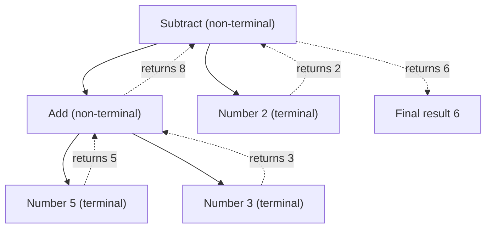

# Interpreter Pattern

> **Intent:** Represent a small language's grammar as a tree of objects and give each object the ability to evaluate ("interpret") itself.

**In plain words:** You turn an expression like "(5 + 3) - 2" into a tree of little objects, and each object knows how to compute its own value. It is like a math worksheet where every bracket does its own sum and passes the answer up to the next line.

**Category:** Behavioral

## Participants
- **Abstract Expression** (`IExpression`) — declares the single `Interpret()` method every node must implement.
- **Terminal Expression** (`Number`) — a leaf holding a literal value; `Interpret()` just returns that value.
- **Non-terminal Expression** (`Add`, `Subtract`) — nodes that hold two child `IExpression`s and combine their interpreted results (`+` or `-`).
- **Client** (`InterpreterPattern`) — builds the expression tree from the objects above and calls `Interpret()` on the root.

## Flow diagram

## How it works (in this project)
1. `InterpreterPattern.Run()` builds the tree for `(5 + 3) - 2`: the root is a `Subtract` whose left child is an `Add(Number(5), Number(3))` and whose right child is `Number(2)`.
2. Calling `expression.Interpret()` on the root `Subtract` asks each child to interpret itself first.
3. `Add.Interpret()` calls `Interpret()` on `Number(5)` and `Number(3)`, which return `5` and `3`; `Add` returns `5 + 3 = 8`.
4. `Number(2).Interpret()` returns `2`.
5. `Subtract` computes `8 - 2 = 6` and returns it. Results bubble up the tree, and `Run()` prints `6`.

## When to use
- You have a simple, well-defined grammar (arithmetic, rules, filters, query strings) that you want to evaluate at runtime.
- The grammar is stable and small enough that one class per rule stays manageable.
- You want expressions to be composable and reusable as objects.

## When NOT to
- The grammar is large or changes often — the class-per-rule explosion becomes hard to maintain.
- Performance is critical — a hand-written parser or an existing parser generator will usually beat a tree of objects.
- The problem is not really a language; do not force everyday branching logic into this pattern.

## Gotchas
- Interpreter defines the tree structure and how to *evaluate* it, but it does **not** parse text. Turning `"(5 + 3) - 2"` into the tree is a separate step (here the client builds it by hand).
- Every node type must implement `IExpression`, including terminals — forgetting `Number` is a leaf that also needs `Interpret()` is a common slip.
- The recursion relies on well-formed trees; a non-terminal missing a child (a null `IExpression`) will blow up at evaluation time, not at build time.
