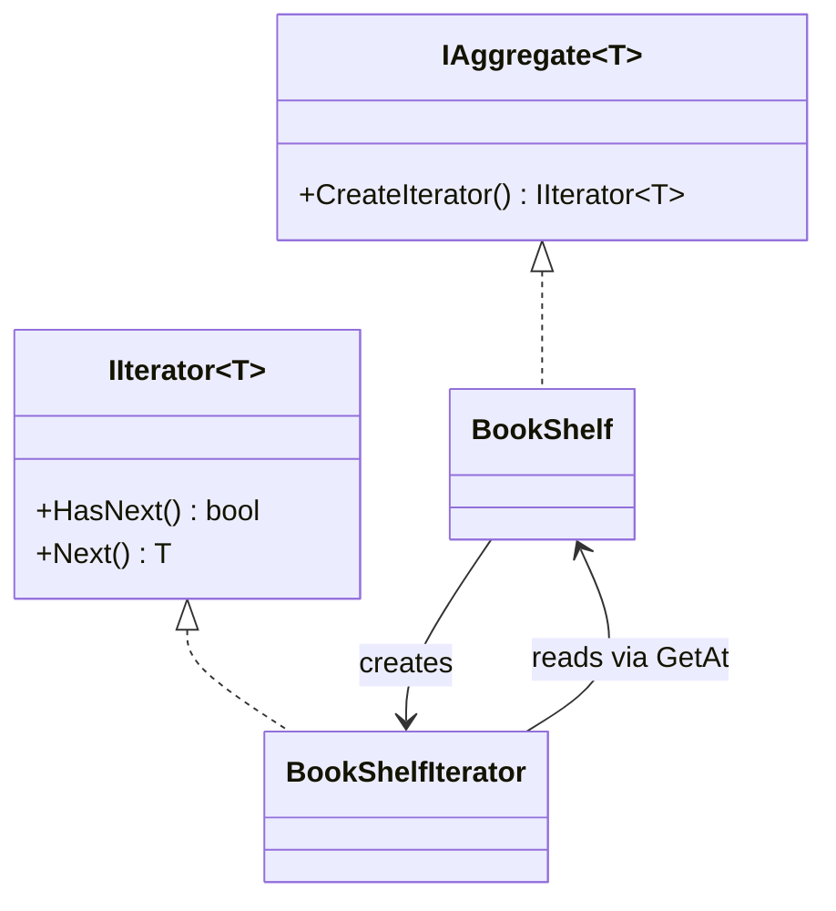

# Iterator Pattern

> **Intent:** Provide a way to access the elements of an aggregate sequentially without exposing its underlying representation — this is the hand-rolled GoF version, using custom `IIterator`/`IAggregate` interfaces rather than .NET's built-in `IEnumerable`/`foreach`.

**Category:** Behavioral

## Participants
- **Iterator** (`IIterator<T>`) — declares `HasNext()` and `Next()`.
- **Aggregate** (`IAggregate<T>`) — declares `CreateIterator()`.
- **Concrete Aggregate** (`BookShelf`) — stores books in an array and returns a new iterator over itself; exposes `Count` and `GetAt` for the iterator.
- **Concrete Iterator** (`BookShelfIterator`) — holds the cursor `_index` and walks the shelf via `HasNext`/`Next`.
- **Client** (`IteratorPattern`) — builds a shelf and loops through it via `Run()`.

## Flow diagram

## How it works (in this project)
1. `IteratorPattern.Run()` creates a `BookShelf(3)` and adds three titles.
2. `shelf.CreateIterator()` returns a `BookShelfIterator` bound to that shelf.
3. The `while (it.HasNext())` loop calls `it.Next()`, which reads `_shelf.GetAt(_index++)` — the cursor lives inside the iterator, not the shelf.
4. The client never touches the internal array; it only knows `HasNext`/`Next`.

## When to use
- You need to traverse a collection without exposing its internal structure.
- You want multiple independent cursors over the same aggregate.
- You want a uniform traversal interface across different collection types.

## Analogy
A TV remote's channel-up button steps through channels one at a time without you knowing how they are stored.
