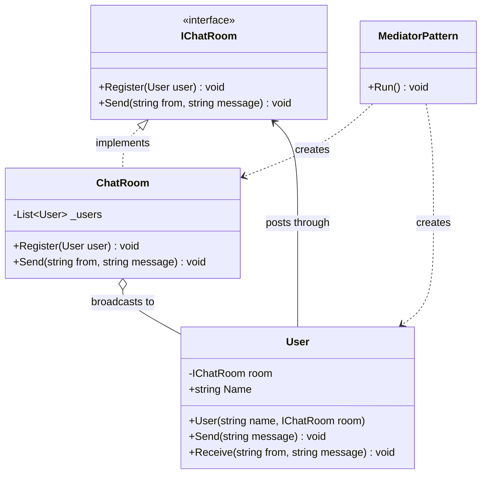
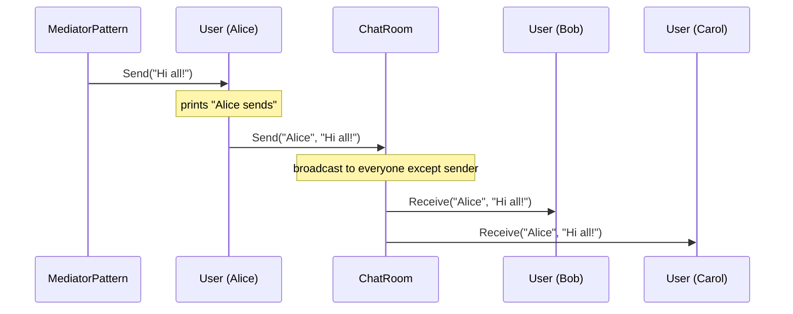
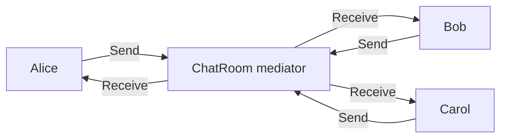

# Mediator Pattern

> **Intent:** Centralize communication between objects in a mediator so they no longer refer to each other directly.

**In plain words:** Like a group chat room — instead of everyone texting everyone one-to-one, each person posts to the room and the room delivers messages to the rest.

**Category:** Behavioral

## Participants
- **Mediator** (`IChatRoom`) — the interface every colleague talks through: `Register` and `Send`.
- **Concrete Mediator** (`ChatRoom`) — holds the list of users and broadcasts each message to everyone except the sender.
- **Colleague** (`User`) — knows only the room, not other users; `Send` posts through the room, `Receive` handles incoming messages.
- **Client** (`MediatorPattern`) — sets up the room and users, then triggers a send.

## UML class diagram

> New to UML notation? See [UML-GUIDE](../UML-GUIDE.md).

## Sequence diagram

## Flow diagram

## How it works (in this project)
1. `MediatorPattern.Run()` creates one `ChatRoom` and three `User`s (Alice, Bob, Carol), each constructed with a reference to that room.
2. `room.Register(...)` adds each user to the room's internal `_users` list.
3. `alice.Send("Hi all!")` prints "Alice sends" then calls `room.Send("Alice", "Hi all!")` — the user goes through the mediator, never touching Bob or Carol directly.
4. `ChatRoom.Send` loops over `_users.Where(u => u.Name != from)` and calls `Receive` on each, so Bob and Carol get the message but Alice does not echo to herself.

## When to use
- Many objects interact in complex ways and the wiring has become a tangled mesh.
- You want to reuse colleagues independently, without them hard-referencing each other.
- Interaction rules (who talks to whom, filtering) should live in one place.

## When NOT to
- Only two objects talk to each other — a mediator adds a needless middleman.
- The interaction logic is trivial; a direct reference is clearer.

## Gotchas
- Without a mediator, N users need up to N*(N-1) direct links (a peer-to-peer mesh); the room replaces that with hub-and-spoke, so each user knows only the room.
- The mediator can become a "god object" — as rules grow, `ChatRoom` accumulates all the coordination logic and gets hard to maintain.
- Users must be `Register`ed with the room, or they silently receive nothing.
