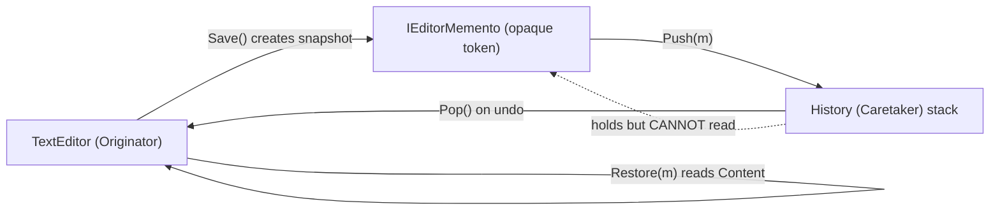

# Memento Pattern

> **Intent:** Capture an object's internal state in a snapshot so it can be restored later, without exposing that internal state to the outside world.

**In plain words:** The editor hands out a sealed "save point" that only it can open again; something else just holds the save points for you. It is like a game save file: the save system stores it, but only the game knows how to read what is inside.

**Category:** Behavioral

## Participants
- **Originator** (`TextEditor`) — owns the state (`_content`); creates snapshots via `Save()` and reloads them via `Restore()`.
- **Memento** (`TextEditor.Memento`, private nested) — the real snapshot holding `Content`; only `TextEditor` can see inside it.
- **Opaque token** (`IEditorMemento`) — an empty interface the snapshot implements so outsiders can hold it but read nothing from it.
- **Caretaker** (`History`) — keeps a stack of mementos and hands them back on undo, but never inspects them.
- **Client** (`MementoPattern`) — wires the editor and history together and drives the save/undo demo.

## Flow diagram

## How it works (in this project)
1. `MementoPattern.Run()` creates a `TextEditor` and a `History`.
2. The editor types text and calls `editor.Save()`, which returns an `IEditorMemento`. Behind that interface is the private `TextEditor.Memento` holding a copy of `_content`.
3. `history.Push(...)` stores each snapshot on its stack. `History` only sees the empty `IEditorMemento`, so it cannot read the saved text.
4. After more typing, `editor.Restore(history.Pop()!)` pops the most recent snapshot; `Restore` casts it back to the private `Memento` and copies `Content` into `_content`.
5. Two pops walk back through checkpoint 2 ("Hello, world") and checkpoint 1 ("Hello"), demonstrating undo.

## When to use
- You need undo/redo, checkpoints, or rollback of an object's state.
- You want to snapshot state without breaking encapsulation (the state stays private to its owner).
- The set of saved states is naturally managed elsewhere (a history/stack).

## When NOT to
- The state is huge or snapshots are frequent — storing many full copies can be expensive in memory.
- The object's state is already simple and public, or a value/immutable object would let you just keep old references instead.
- You would need the caretaker to actually read or edit the snapshot — that breaks the whole point of the opaque token.

## Gotchas
- `IEditorMemento` is deliberately **empty**. That is the trick: `History` can hold it but cannot touch the content. Do not add getters to it "for convenience" — that leaks the encapsulation.
- Only `TextEditor` can turn the token back into the real `Memento`. Passing a memento created elsewhere into `Restore()` throws `ArgumentException`.
- The snapshot stores the state at save time; because `Memento.Content` is a `string` (immutable) copy, later typing does not mutate old snapshots. With mutable state you must copy defensively.
