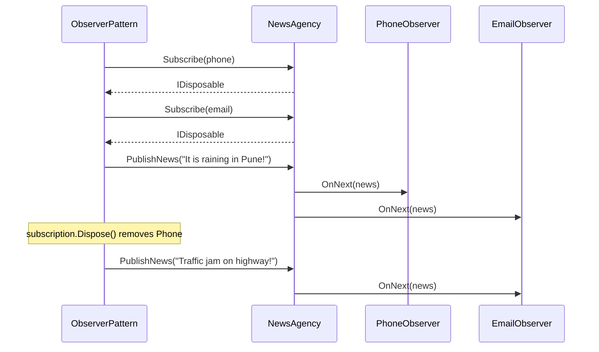
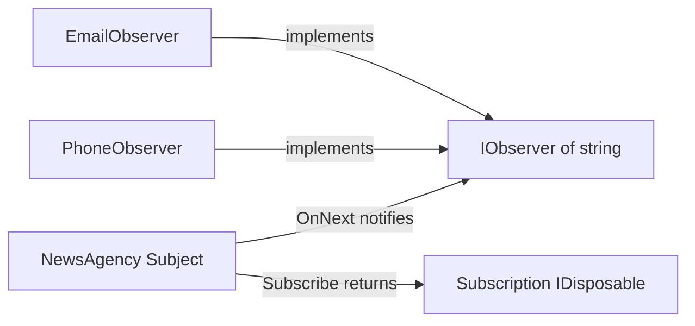

# Observer Pattern

> **Intent:** Let a subject maintain a list of dependents and notify them automatically whenever its state changes, keeping subject and observers loosely coupled.

**Category:** Behavioral

## Participants
- **Subject / Observable** (`NewsAgency`) — implements `IObservable<string>`; keeps a list of observers, hands back an `IDisposable` on `Subscribe()`, pushes updates via `PublishNews()` (calls `OnNext`) and signals the end via `Close()` (calls `OnCompleted`).
- **Subscription** (`NewsAgency.Subscription`) — private `IDisposable` that removes an observer on `Dispose()` (unsubscribe).
- **Observer** (`IObserver<string>`) — built-in .NET interface with `OnNext`, `OnError`, `OnCompleted`.
- **Concrete Observers** (`PhoneObserver`, `EmailObserver`) — print received news to their own channel.
- **Client** (`ObserverPattern`) — demo entry point that subscribes observers, publishes, unsubscribes one, then closes.

## UML class diagram

> New to UML notation? See [UML-GUIDE](../UML-GUIDE.md).

```mermaid
classDiagram
    class IObservable~string~ {
        <<interface>>
        +Subscribe(IObserver~string~ observer) IDisposable
    }
    class IObserver~string~ {
        <<interface>>
        +OnNext(string value) void
        +OnError(Exception error) void
        +OnCompleted() void
    }
    class IDisposable {
        <<interface>>
        +Dispose() void
    }
    class NewsAgency {
        -List~IObserver~ _observers
        +Subscribe(IObserver~string~ observer) IDisposable
        +PublishNews(string news) void
        +Close() void
    }
    class Subscription {
        -List~IObserver~ _list
        -IObserver~string~ _observer
        +Dispose() void
    }
    class PhoneObserver {
        -string _name
        +PhoneObserver(string name)
        +OnNext(string news) void
        +OnError(Exception e) void
        +OnCompleted() void
    }
    class EmailObserver {
        -string _email
        +EmailObserver(string email)
        +OnNext(string news) void
        +OnError(Exception e) void
        +OnCompleted() void
    }
    class ObserverPattern {
        +Run() void
    }
    IObservable <|.. NewsAgency : implements
    IObserver <|.. PhoneObserver : implements
    IObserver <|.. EmailObserver : implements
    IDisposable <|.. Subscription : implements
    NewsAgency o-- "0..*" IObserver : notifies
    NewsAgency *-- Subscription : nested; created on Subscribe
    Subscription --> IObserver : removes on Dispose
    ObserverPattern ..> NewsAgency : drives
    note "IObservable, IObserver and IDisposable are built-in .NET interfaces (element type here is IObserver of string)"
```

## Sequence diagram



## Flow diagram



## How it works (in this project)
1. `ObserverPattern.Run()` creates a `NewsAgency` and a list of observers: two `PhoneObserver`s and one `EmailObserver`.
2. Each observer is registered with `agency.Subscribe(observer)`, returning an `IDisposable` stored for later unsubscription.
3. `agency.PublishNews("It is raining in Pune!")` calls `OnNext` on every observer, so all three print the news.
4. Disposing the first subscription removes Raj's phone; the next `PublishNews` reaches only the remaining observers.
5. `agency.Close()` calls `OnCompleted` on all observers, signalling no more news.

## When to use
- One object's change must be broadcast to an unknown/variable number of dependents.
- You want publishers and subscribers decoupled so either side can vary independently.
- You need runtime subscribe/unsubscribe support (event systems, notifications, live UI updates).

## Analogy
A news agency broadcasts headlines to every subscriber's phone or email, and anyone can unsubscribe at any time.
