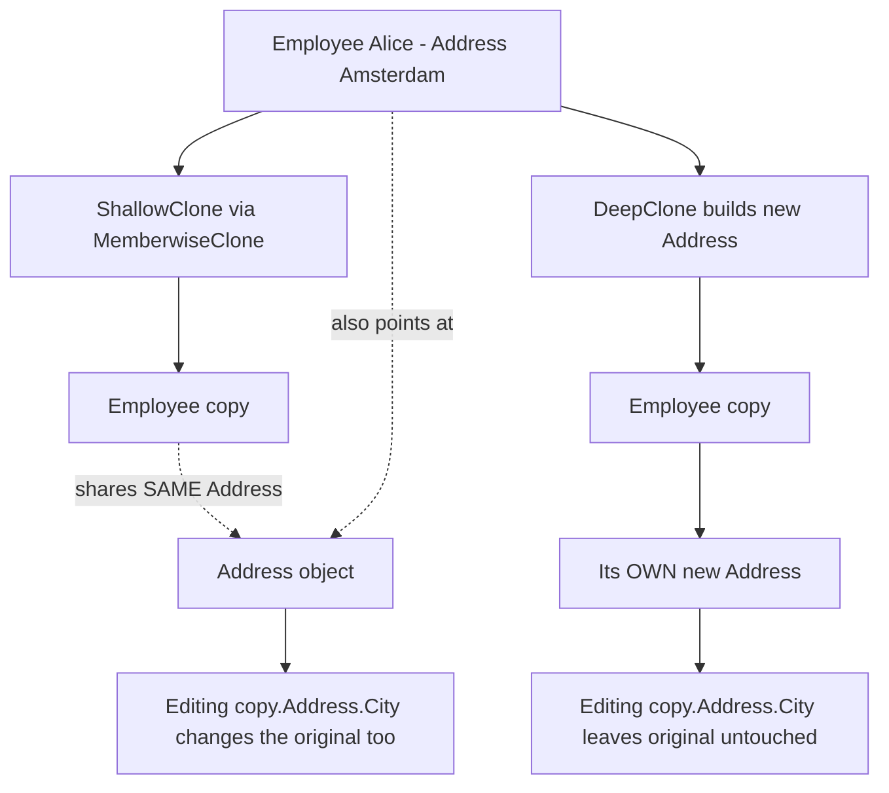

# Prototype Pattern

> **Intent:** Create new objects by cloning an existing instance instead of building them from scratch.

**In plain words:** Rather than constructing an object step by step again, you take one you already have and copy it. Like photocopying a filled-in form instead of writing a new one — but watch out: a quick copy might still point at the same attachments as the original.

**Category:** Creational

## Participants
- **Prototype** (`Employee`) — the object that can copy itself. Holds a `Name` (a `string`) and an `Address` (a nested reference type). Exposes `ShallowClone()` and `DeepClone()`.
- **Nested reference type** (`Address`) — a separate object (`City`) held by reference inside `Employee`. Whether this is shared or copied is the whole point of the pattern.
- **Client** (`PrototypePattern`) — the demo entry point `PrototypePattern.Run()`; clones an original employee both ways and prints the results to show the difference.

## Flow diagram

## How it works (in this project)
1. `PrototypePattern.Run()` creates `original = new Employee("Alice", new Address("Amsterdam"))`.
2. `original.ShallowClone()` calls `MemberwiseClone()`, which copies fields bit-for-bit. `Name` (a string) becomes its own value, but the `Address` reference is **shared** — both employees point at the same `Address` object.
3. So `shallow.Address.City = "Rotterdam"` also changes `original.Address.City` — the original is unexpectedly mutated.
4. `original.DeepClone()` instead builds `new Address(Address.City)`, giving the copy its **own** `Address`. Now `deep.Address.City = "Utrecht"` leaves the original as `"Rotterdam"`.

## When to use
- Creating a new object is expensive or complicated, and you already have a suitable instance to copy.
- You need many similar objects that differ only slightly from a template.

## When NOT to
- Objects are cheap and simple to construct directly — cloning adds indirection for no gain.
- The object graph has many nested references and cycles; a correct deep clone becomes hard to maintain.

## Gotchas
- **Shallow clone shares nested reference objects.** `MemberwiseClone()` copies references, not the objects they point to, so mutating a nested object through the copy hits the original too.
- Value types and strings are effectively copied safely; nested class instances are the danger.
- Deep cloning must be written by hand (as `DeepClone()` does here) and kept in sync whenever you add new reference-type fields — forget one and it silently stays shared.
