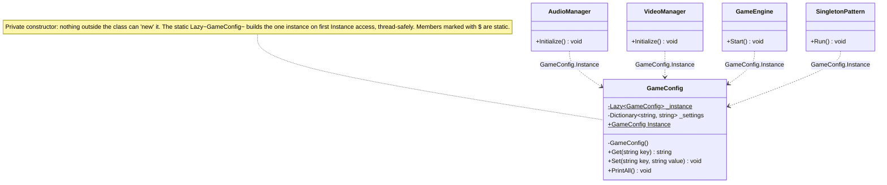
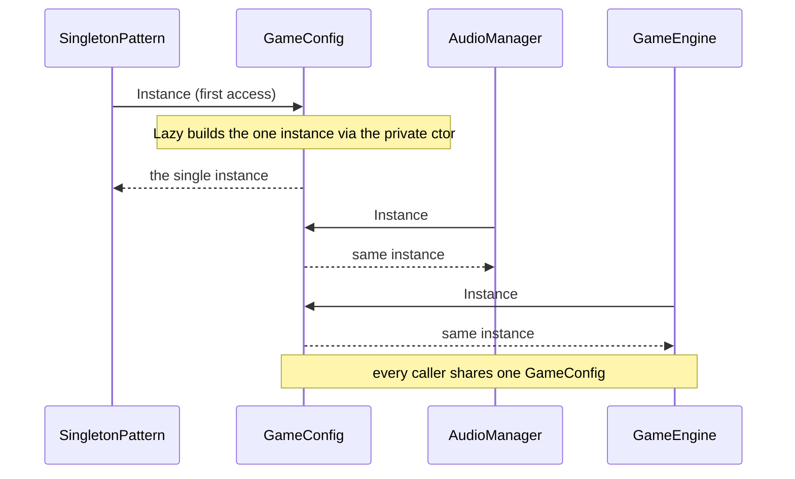
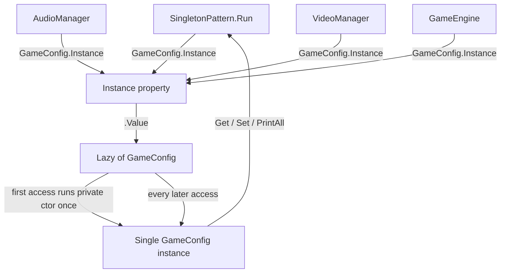

# Singleton Pattern

> **Intent:** Guarantee a class has exactly one instance and give the whole application a single global access point to it.

**Category:** Creational

## Participants
- **Singleton** (`GameConfig`) — sealed class with a private constructor, a `static readonly Lazy<GameConfig>` field, and the public `Instance` accessor; holds the shared settings dictionary with `Get`, `Set`, `PrintAll`.
- **Lazy Holder** (`Lazy<GameConfig>`) — creates the single instance only on first access and thread-safely returns the same one afterward.
- **Clients** (`AudioManager`, `VideoManager`, `GameEngine`) — each reads `GameConfig.Instance` to get sound, resolution, and difficulty respectively.
- **Demo** (`SingletonPattern`) — `Run()` exercises the instance, mutates it, and proves identity with `ReferenceEquals`.

## UML class diagram

> New to UML notation? See [UML-GUIDE](../UML-GUIDE.md).

## Sequence diagram

## Flow diagram

## How it works (in this project)
1. `SingletonPattern.Run()` calls `GameConfig.Instance.PrintAll()`; this first access triggers `Lazy<GameConfig>.Value`, which runs the private constructor once (`GameConfig created — only once!`) and loads default settings.
2. `AudioManager`, `VideoManager`, and `GameEngine` each call `GameConfig.Instance` and read their setting — all get the same object.
3. `Run()` calls `GameConfig.Instance.Set("difficulty", "Hard")` and `Set("sound", "Off")`; re-initializing the modules shows the updated values immediately, because there is one shared state.
4. `ref1`, `ref2`, `ref3` from `Instance` are compared with `ReferenceEquals`, both returning `true`, confirming a single instance.

## When to use
- One logger, cache, or configuration object shared across the whole app.
- A single shared resource such as a database connection pool.
- Note: in modern .NET, prefer a DI container registering the type as a singleton over this manual approach.

## Analogy
A game's global settings screen: wherever you open it, it is the same settings — change the difficulty once and every part of the game sees it.
