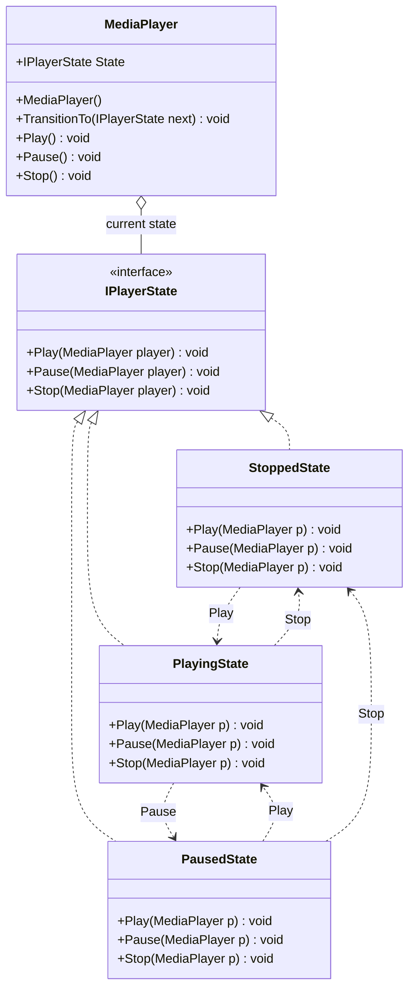
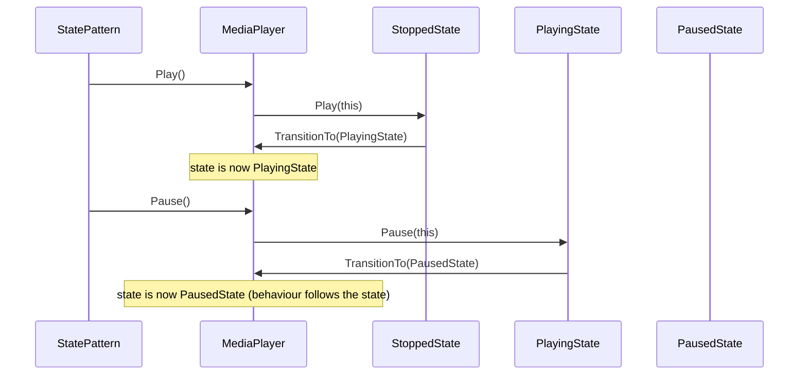
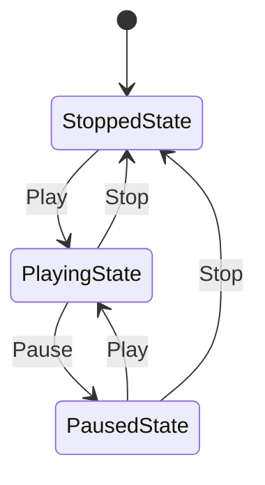

# State Pattern

> **Intent:** Let an object alter its behavior when its internal state changes, so the object appears to change its class — replacing `if`/`switch` branching with state objects that handle actions and trigger transitions.

**Category:** Behavioral

## Participants
- **Context** (`MediaPlayer`) — holds the current `IPlayerState`, delegates `Play`/`Pause`/`Stop` to it, and exposes `TransitionTo` so states can swap it out. No conditional logic of its own.
- **State** (`IPlayerState`) — interface declaring the actions `Play`, `Pause`, `Stop`, each receiving the `MediaPlayer`.
- **Concrete State** (`StoppedState`) — starts playback on `Play` (→ `PlayingState`); ignores `Pause`/`Stop`.
- **Concrete State** (`PlayingState`) — pauses on `Pause` (→ `PausedState`), stops on `Stop` (→ `StoppedState`); ignores `Play`.
- **Concrete State** (`PausedState`) — resumes on `Play` (→ `PlayingState`), stops on `Stop` (→ `StoppedState`); ignores `Pause`.
- **Client** (`StatePattern`) — drives the demo via `Run()`.

## UML class diagram

> New to UML notation? See [UML-GUIDE](../UML-GUIDE.md).

## Sequence diagram

## Flow diagram

## How it works (in this project)
1. `StatePattern.Run()` creates a `MediaPlayer`, whose constructor sets the initial state to `StoppedState`.
2. `MediaPlayer.Play()` just calls `State.Play(this)` — the current state decides what happens.
3. `StoppedState.Play` prints "Starting from beginning" and calls `p.TransitionTo(new PlayingState())`.
4. `TransitionTo` logs the new state name and swaps the `State` reference.
5. Subsequent calls (`Pause`, `Play`, `Stop`) are handled by whichever state is now current — invalid actions (e.g. `Pause` while stopped) are simply ignored with a message, no branching in the context.

## When to use
- An object's behavior depends on its state and must change at runtime.
- You have large `if`/`switch` statements keyed on a state field.
- State-specific behavior and transition rules should live together, not scattered across the context.

## Analogy
A media player button does something different depending on whether the track is stopped, playing, or paused.
