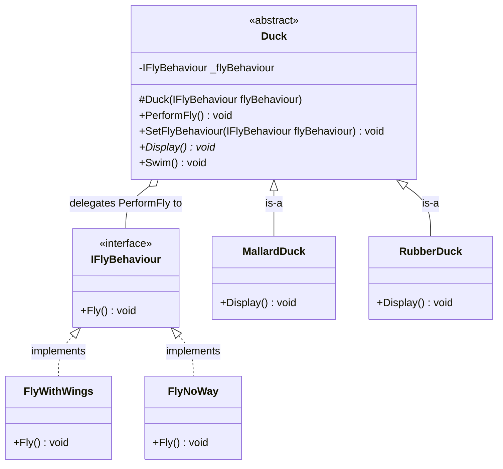
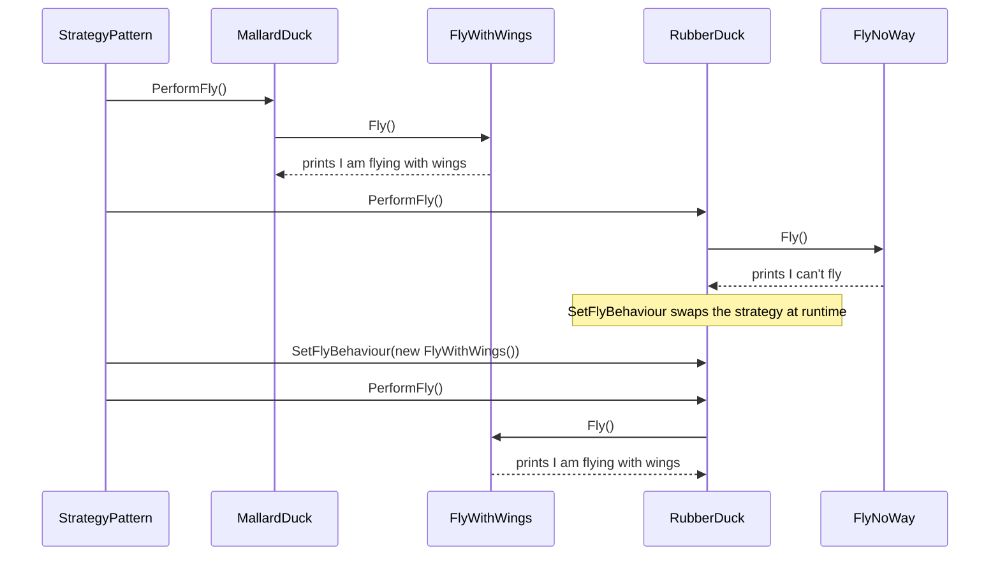
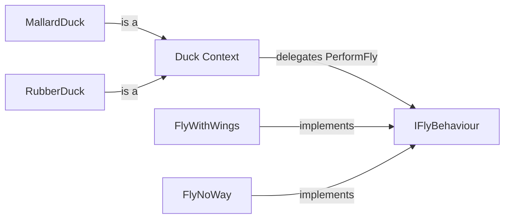

# Strategy Pattern

> **Intent:** Encapsulate interchangeable behaviours behind a common interface so a context object can swap them at runtime instead of hard-coding the logic.

**Category:** Behavioral

## Participants
- **Context** (`Duck`) — abstract base that holds an `IFlyBehaviour` and delegates `PerformFly()` to it; also exposes `SetFlyBehaviour()` to swap the strategy at runtime.
- **Concrete Contexts** (`MallardDuck`, `RubberDuck`) — supply an initial strategy via the base constructor (`FlyWithWings` and `FlyNoWay` respectively) and implement `Display()`.
- **Strategy** (`IFlyBehaviour`) — interface declaring `Fly()`.
- **Concrete Strategies** (`FlyWithWings`, `FlyNoWay`) — the interchangeable flying implementations.
- **Client** (`StrategyPattern`) — demo entry point that builds ducks and switches behaviour at runtime.

## UML class diagram

> New to UML notation? See [UML-GUIDE](../UML-GUIDE.md).

## Sequence diagram

## Flow diagram

## How it works (in this project)
1. `StrategyPattern.Run()` creates a `MallardDuck`, initialised through `Duck(new FlyWithWings())`.
2. `mallardDuck.PerformFly()` delegates to the current `IFlyBehaviour`, printing the FlyWithWings message; `Swim()` uses shared base behaviour.
3. A `RubberDuck` is created with `FlyNoWay`, so `PerformFly()` reports it can't fly.
4. `rubberDuck.SetFlyBehaviour(new FlyWithWings())` swaps the strategy at runtime, and the next `PerformFly()` now flies.

## When to use
- Several variants of an algorithm/behaviour exist and you want to choose or swap them at runtime.
- You want to avoid large `if`/`else` or `switch` blocks that select behaviour.
- You want behaviour to vary independently from the objects that use it (payment methods, sorting, discounts, export formats).

## Analogy
A duck delegates "how to fly" to a plug-in strategy, so you can bolt on rocket power without changing the duck.
