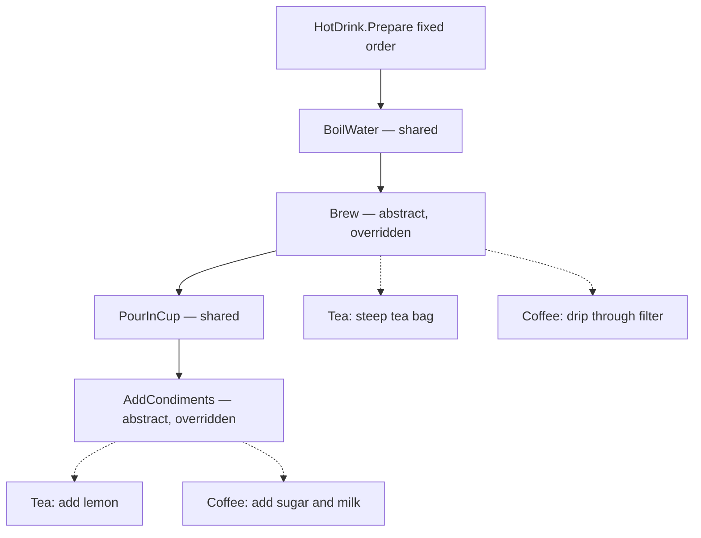

# Template Method Pattern

> **Intent:** Define the skeleton of an algorithm in a base class, deferring the steps that vary to subclasses without letting them change the algorithm's structure or order.

**Category:** Behavioral

## Participants
- **Abstract Class** (`HotDrink`) — defines the template method `Prepare()` which fixes the step order; implements the shared steps `BoilWater` and `PourInCup`; declares abstract `Brew` and `AddCondiments`.
- **Concrete Class** (`Tea`) — overrides `Brew` (steep tea bag) and `AddCondiments` (add lemon).
- **Concrete Class** (`Coffee`) — overrides `Brew` (drip through filter) and `AddCondiments` (add sugar and milk).
- **Client** (`TemplateMethodPattern`) — calls `Prepare()` on each drink via `Run()`.

## Flow diagram

## How it works (in this project)
1. `TemplateMethodPattern.Run()` creates a `Tea` (as `HotDrink`) and calls `Prepare()`.
2. `HotDrink.Prepare()` runs the fixed sequence: `BoilWater()` → `Brew()` → `PourInCup()` → `AddCondiments()`.
3. `BoilWater` and `PourInCup` are private methods in the base class — identical for every drink.
4. `Brew` and `AddCondiments` are abstract, so `Tea` supplies steeping + lemon; the base class never knows the specifics.
5. `Run()` then repeats with a `Coffee`, reusing the same skeleton but producing coffee-specific output.

## When to use
- Several classes share the same overall algorithm but differ in individual steps.
- You want to control step order and prevent subclasses from altering it.
- You want to eliminate duplicated boilerplate across similar routines (parsers, report generators, build pipelines).

## Analogy
Making tea or coffee follows the same recipe — boil, brew, pour, add extras — only the brew and the extras differ.
