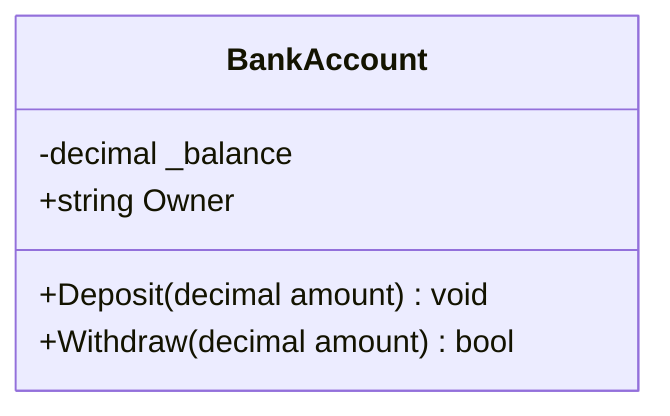
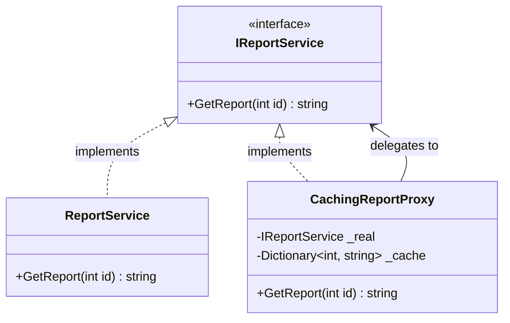

# How to read the UML class diagrams

Every pattern note has a **UML class diagram** (a Mermaid `classDiagram`). This page explains the
notation so you can tell at a glance what is a class, an interface, a field, a property, a method,
and how the boxes are related.

## A box = a type

- The **top** is the type name.
- The **middle** lists **fields and properties** (no `()`).
- The **bottom** lists **methods** (they have `()` and usually a return type).

## Stereotypes — class vs interface vs abstract vs enum

A label in `«guillemets»` above the name tells you *what kind* of type it is:

| Shown as | Meaning |
|---|---|
| *(no stereotype)* | a normal **class** |
| `«interface»` | an **interface** (a contract — only method signatures, no implementation) |
| `«abstract»` | an **abstract class** (can't be instantiated; may have some implemented members) |
| `«enumeration»` | an **enum** |

*Italic* member names also indicate **abstract** members (must be overridden).

## Visibility symbols (the first character of a member)

| Symbol | C# meaning |
|---|---|
| `+` | **public** |
| `-` | **private** (e.g. a backing field like `_real`) |
| `#` | **protected** |
| `~` | **internal** (package-private) |
| `$` (suffix) | **static** |

So `-IReportService _real` is a **private field**, and `+string Owner` is a **public property**.
Fields (data) have no parentheses; methods (behaviour) do: `+Deposit(decimal amount) void`.

## Relationship arrows (how boxes connect)

| Arrow | Name | Reads as |
|---|---|---|
| `A <|-- B` | **Inheritance** (generalization) | `B` **is-a** `A` (B extends class A) |
| `A <|.. B` | **Realization** | `B` **implements** interface `A` |
| `A *-- B` | **Composition** | `A` **owns** `B`; B dies with A (strong "part-of") |
| `A o-- B` | **Aggregation** | `A` **has** `B`; B can outlive A (weak "has-a") |
| `A --> B` | **Association** | `A` **references / uses** `B` (holds a reference) |
| `A ..> B` | **Dependency** | `A` **uses** `B` loosely (e.g. as a method parameter) |

The arrowhead points at the **more general / owned-contract** side: a hollow triangle (`<|`) points
at the base class or interface. A label on the line (e.g. `: delegates to`) explains the link.

## Putting it together

Read it as: *`ReportService` and `CachingReportProxy` both **implement** the `IReportService`
interface; the caching proxy **holds and delegates to** a real `IReportService`.* The `~ ~` around
`int, string` is how Mermaid writes **generics** (`Dictionary<int, string>`).

> Tip: interfaces/abstract types usually sit at the top; concrete classes point **up** to them.
