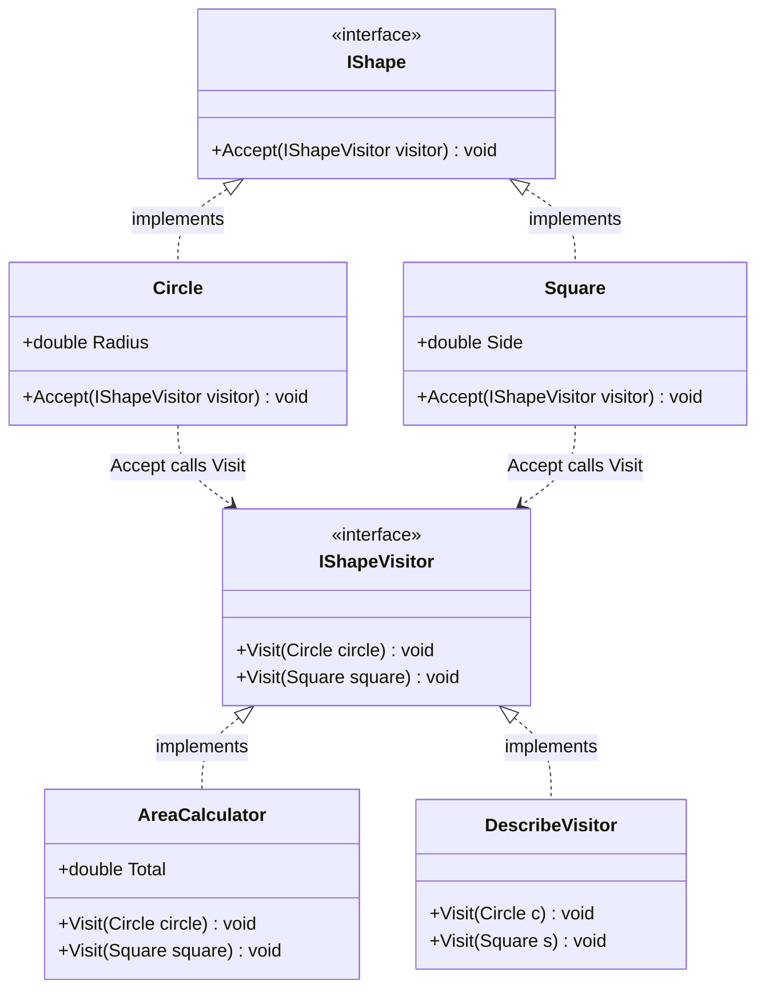
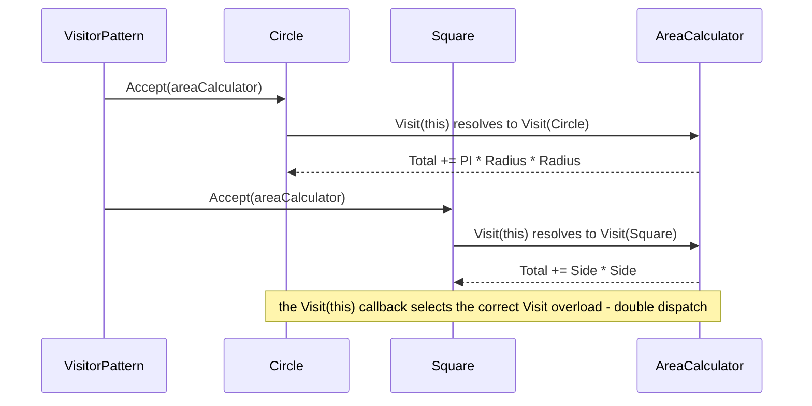
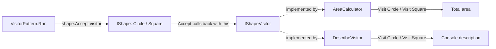

# Visitor Pattern

> **Intent:** Add new operations to a family of objects without changing their classes, by moving each operation into its own separate "visitor" object.

**In plain words:** Your shapes stay fixed; you write a new visitor whenever you want a new thing done to them. Like a museum guide (visitor) who walks past the same exhibits (shapes): swap the guide and you get a different tour, but the exhibits never change.

**Category:** Behavioral

## Participants
- **Element** (`IShape`) — declares `Accept(IShapeVisitor visitor)`.
- **Concrete Elements** (`Circle`, `Square`) — implement `Accept` by calling `visitor.Visit(this)`, where `this` is their own type.
- **Visitor** (`IShapeVisitor`) — declares one `Visit` overload per concrete element: `Visit(Circle)` and `Visit(Square)`.
- **Concrete Visitors** (`AreaCalculator`, `DescribeVisitor`) — implement the operations. `AreaCalculator` sums areas into `Total`; `DescribeVisitor` prints a description.
- **Client** (`VisitorPattern`) — builds shapes and pushes visitors over them.

## UML class diagram

> New to UML notation? See [UML-GUIDE](../UML-GUIDE.md).

## Sequence diagram

The `..>` links capture double dispatch: each element's `Accept` calls back into the visitor via `Visit(this)`, so the concrete method run depends on both the shape type and the visitor type. (`Total` on `AreaCalculator` has a private setter.)

## Flow diagram

## How it works (in this project)
1. `VisitorPattern.Run()` is the demo entry point. It creates an array of `IShape`: two `Circle`s and a `Square`.
2. **Operation 1 — describe.** A `DescribeVisitor` is created and each `shape.Accept(describe)` runs. `Circle.Accept` calls `describe.Visit(this)`, resolving to `Visit(Circle)`; `Square.Accept` resolves to `Visit(Square)`.
3. **Operation 2 — area.** An `AreaCalculator` walks the same shapes. Each `Accept` routes to the matching `Visit` overload, accumulating into `AreaCalculator.Total`.
4. The final line prints `Total area: 24.71` (π·4 + 9 + π·1).
5. **Double dispatch:** the method actually called depends on *two* types at once — the element type (chosen by which `Accept` runs) and the visitor type (chosen by which object's `Visit` runs). One virtual call picks the element, the overload picks the visitor.

## When to use
- You have a stable set of element classes but keep needing new operations over them.
- You want related operations grouped in one place (a visitor) instead of scattered across every element.
- Adding a new operation should not force edits to `Circle`, `Square`, etc. — just write a new `IShapeVisitor`.

## When NOT to
- The set of element types changes often — every new element forces a new `Visit` method on every visitor.
- There are only one or two simple operations; a plain method on the element is simpler.
- Operations need private internals of elements that the elements don't expose.

## Gotchas
- Adding a new *operation* is cheap (one new visitor); adding a new *shape* is expensive (touch `IShapeVisitor` and every existing visitor). Visitor trades one kind of flexibility for the other.
- The double dispatch relies on `Accept` calling `visitor.Visit(this)`. If you instead switch/`is`-check on the shape type inside the visitor, you lose the pattern's benefit and reintroduce the type checks it was meant to remove.
- Each visitor must handle every element type, or the interface won't compile — which is the point: it keeps operations complete across all shapes.
